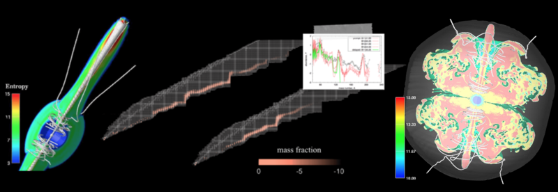

# mrsn
The r-process nucleosynthesis in magnetorotational core-collapse supernovae. The numerical data of trajectories and nucleosynthesis yields by Nishimura, Takiwaki and Thielemann (2015, ApJ 810 109).

**This repository is still in preparation.**

- See Website: http://www.astro.keele.ac.uk/~nobuya/mrsn

Nobuya Nishimura
